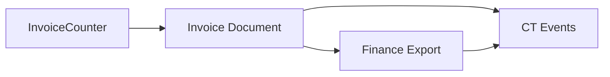

### Data Security


# 1) Canonicalise the top fields (what, why, how)

## What to do

Pick the ~10–15 most reused fields and define a **single, canonical spec** (name, type, format, constraints, example). Everything else references these.

## Proposed canonical set (draft)

* `contractor_id: string` (ksuid/uuid; stable, never re-used)
* `client_id: string`
* `invoice_number: string` (format: `/^INV-\d{4}-\d{4}$/` or ksuid; unique)
* `invoice_date: string` (ISO-8601 date; e.g., `2025-09-27`)
* `money`: represented as

  ```json
  { "amount_minor": 123456, "currency": "GBP" }
  ```

  (integer pennies + ISO-4217) — avoids float issues
* `vat_number: string` (country-specific validation later)
* `sage_id: string` (external ref to finance system; nullable)
* `address` object:

  ```json
  {
    "address_line_1": "string",
    "address_line_2": "string|null",
    "city": "string",
    "postcode": "string",
    "country": "string"   // ISO 3166-1 alpha-2 later
  }
  ```
* `status: string` (enum per domain; e.g., invoice: `draft|accepted|paid|archived`)
* `approval_status: string` (timesheet: `pending|approved|rejected`)
* `reconciled: boolean` (finance)
* `created_at|updated_at: string` (ISO-8601 datetime)

## JSON Schema stencil (drop-in)

Put this under `docs/schemas/common/` and import from other schemas.

```json
{
  "$id": "https://swan/schemas/common.json",
  "$schema": "http://json-schema.org/draft-07/schema#",
  "title": "Swan Common Types",
  "type": "object",
  "definitions": {
    "Id": { "type": "string", "minLength": 8 },
    "Ksuid": { "type": "string", "minLength": 20 },
    "ISODate": { "type": "string", "format": "date" },
    "ISODateTime": { "type": "string", "format": "date-time" },
    "Money": {
      "type": "object",
      "required": ["amount_minor","currency"],
      "properties": {
        "amount_minor": { "type": "integer", "minimum": 0 },
        "currency": { "type": "string", "minLength": 3, "maxLength": 3 }
      },
      "additionalProperties": false
    },
    "Address": {
      "type": "object",
      "required": ["address_line_1","city","postcode","country"],
      "properties": {
        "address_line_1": { "type": "string" },
        "address_line_2": { "type": ["string","null"] },
        "city": { "type": "string" },
        "postcode": { "type": "string" },
        "country": { "type": "string", "minLength": 2, "maxLength": 2 }
      },
      "additionalProperties": false
    }
  }
}
```

### How to use it

* In `invoice.schema.json`, reference:
  `"invoice_number": { "$ref": "common.json#/definitions/Id" }`,
  `"total": { "$ref": "common.json#/definitions/Money" }`, etc.
* Add a **“Schema owners”** note in the Master WO so drift is owned and reviewed.

**Definition of done:** all active schemas import from `common.json`; we delete duplicate inline definitions.

---

# 2) Name consistency (rules & conversions)

## Naming rules (simple, tough to break)

* **snake_case** for JSON fields: `invoice_number`, `contractor_id`.
* Foreign keys: **must** end with `"_id"`.
* Booleans use plain names (`reconciled: boolean`), not `is_*`.
* Dates: `*_date` for date-only, `*_at` for datetime.
* External IDs: suffix `_id` or `_ref`? → **Use `_id`** (consistent).

## Dealing with legacy variations

* Accept legacy aliases at ingest (e.g., `invoice_no`, `invoiceNumber`) → **normalize** to `invoice_number`, **store alias map** in code.
* Emit only canonical names outwards (APIs, CT events).

**Definition of done:** linter catches non-canonical names; ingest adapters map aliases; WO link: update **Firebase Backend WO** & **CT WO** to include the alias map note.

---

# 3) FK rules (referential integrity you can enforce)

## Rules

* All relationships use `*_id` (string). Never embed “object dumps” as a substitute.
* Cross-doc links **must** include the foreign `*_id` and (optionally) a **cached label** for UX (`client_name`) that’s treated as **non-authoritative**.
* For critical relations, add a **CT consistency check** job (daily): scan for dangling FKs and emit `backend.fn.error` events.

## Example (invoice → contractor/client)

```json
{
  "invoice_number": "INV-2025-0912",
  "contractor_id": "ctr_01JABCD...",
  "client_id": "cli_01JXYZ...",
  "total": { "amount_minor": 123456, "currency": "GBP" }
}
```

**Definition of done:** FK pattern documented in schemas; CT has a “dangling FK” checker; Firebase write paths reject obviously wrong FKs (length/format).

---

# 4) PII policy (redact, hash, or store?)

## Classify & act

* **Direct PII:** name, email, phone, NI number, bank details, passport number → **redact in CT events**; store only refs (e.g., `gs://docs/...`) and minimal metadata.
* **Quasi PII:** address, postcode → keep where needed; mask in CT (city/postcode first area ok if needed).
* **Sensitive business IDs:** `vat_number`, `registered_number` → store; **mask** in reports (`GB*********`).

## Redaction table (implement in CT & Portal ingest)

| Field             | Handling in CT events         | Storage of truth              |
| ----------------- | ----------------------------- | ----------------------------- |
| `email`           | drop or hash (sha256, salt)   | Firestore                     |
| `phone`           | drop                          | Firestore                     |
| `bank_account_*`  | drop                          | Finance system                |
| `passport_number` | drop                          | Firestore (secure collection) |
| `address`         | keep city/country; drop lines | Firestore                     |
| `vat_number`      | keep masked (prefix + last 2) | Firestore                     |

**Definition of done:** CT `/events` middleware enforces redaction; PII table lives in `docs/schemas/PII_POLICY.md`; Finance & Portal WOs reference it.

---

# 5) Field lineage notes (make it traceable)

## What to record per field

* **Source of truth** (where it first becomes official)
* **Transformations** (formatting, combining)
* **Downstream consumers** (who reads it)
* **Audit trail** (which events/runs mention it)

### Example: `invoice_number`

* Source of truth: **InvoiceCounter** generator (Firebase)
* Transformations: formatting `INV-YYYY-####`
* Consumers: Portal receipt, Finance export, CT events, Desktop Manager
* Audit: appears in `finance.invoice.generated`, `finance.payment.webhook`, CT `/runs` logs

### Example: `approval_status` (timesheet)

* SoT: Portal/Backend approval flow
* Consumers: invoice creation job, CT dashboards
* Audit: events `excel.timesheet.ingested`, `backend.fn.error` on mismatches

You can keep these as a **table at the top** of each schema file or a central `field_lineage.md`.

**Definition of done:** top 10 fields get lineage blocks; CT event taxonomy references them consistently.

---

## Optional: push this further (nice wins)

### A) Tag fields in the Field Usage Index

Add two columns:

* **SoT** (source of truth: Portal, Backend, Finance, etc.)
* **Used by** (Portal UI, CT, Finance export, Website, Desktop)

This makes impact analysis trivial (“if we change `invoice_number` format, who breaks?”).

### B) Mini lineage diagrams (Mermaid) for 3 fields

Embed in `docs/design/visuals/field_lineage.mmd` (or inline):



---

# How this ties back to your WOs (where to add what)

* **Firebase Backend WO**

  * Add “Canonical Fields & Ingest Alias Map” section.
  * Note: Money = `{amount_minor, currency}`; all IDs = string; dates = ISO.

* **Contractor Portal WO**

  * Validate canonical names on form; send aliases but normalize server-side.
  * Don’t emit PII to CT; hand it via Firestore only.

* **Finance Integration WO**

  * Enforce `invoice_number` uniqueness; accept Money in minor units; mask VAT in reports.
  * Map `sage_id` consistently; document when it’s missing/null.

* **Control Tower WO**

  * Add “Redaction Middleware Policy” + “Dangling FK Checker” + “PII Table Link”.
  * Event taxonomy: include the canonical fields (e.g., always carry `invoice_number`, never emails).

* **Excel Migration WO**

  * Alias map: Excel headers → canonical names.
  * Run diff report: legacy vs canonical (acceptance criterion).

* **Master WO (Full)**

  * Governance: Schema owners; monthly drift review; KPI on schema compliance (e.g., <1% alias usage post-cutover).

---

# Lightweight CI gates (practical, not heavy)

* **Schema lint**: Validates that child schemas `$ref` `common.json`.
* **Alias detector**: Rejects PRs introducing `invoiceNo`, `InvoiceID`, etc., unless in the explicit alias map.
* **PII exporter**: Static check that CT event payloads don’t include PII fields (block on failure).
* **FK scan**: Job that samples documents to find missing targets; surfaces list in CT digest.

---

## If you want me to implement this now

I can:

1. Create `docs/schemas/common/common.json` with the Money/Address/Id types.
2. Add `docs/schemas/PII_POLICY.md` with the redaction table.
3. Draft a **Field Lineage** page for the top 10 fields.
4. Patch the relevant WOs with short cross-links and “rules boxes”.

Say the word and I’ll wire those into the repo in one pass.
