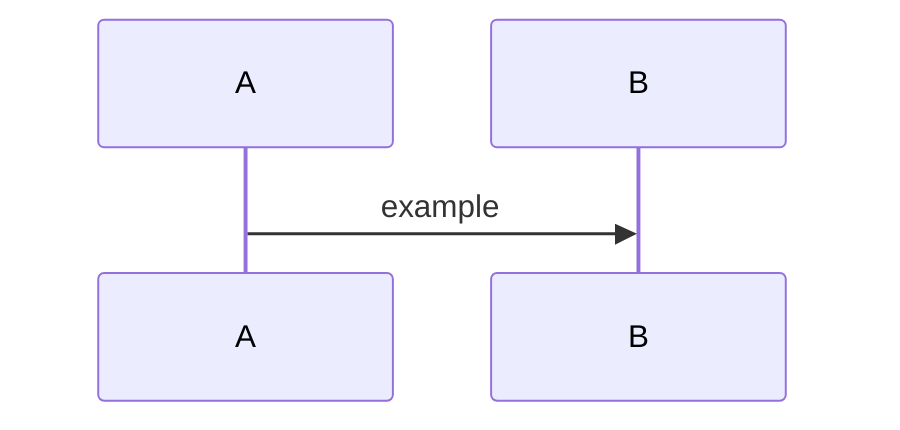

# 📄 Design Spec – <Feature/Module Name>

## 1. Overview
**Purpose:** Why this exists / business problem it solves.  
**Scope:** What this covers and does not cover.

## 2. Inputs & Outputs
**Inputs:** APIs, DB collections, files, user input.  
**Outputs:** Firestore docs, PDFs, API updates, UI changes.

## 3. Architecture & Flow
**High-Level Flow:** short bullet list  

**Components:** Functions, DBs, Apps involved.

## 4. Technology & Dependencies
Libraries, frameworks, external APIs, config, repos.

## 5. Risks & Mitigation
List risks + mitigations.

## 6. Testing & Validation
Unit tests, integration tests, UAT plan.

✅ Deliverable: What “done” means for this spec.
