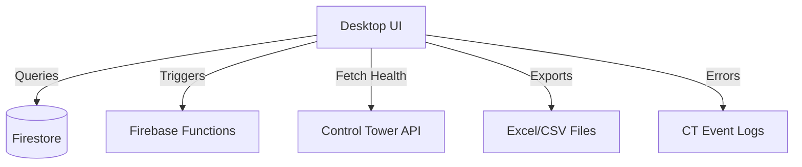

# 🧭 Vision Document: Swan Recruitment – Desktop Manager

**Last updated:** 2025-09-26  
**Related Work Order:** [Desktop Manager WO](../work_orders/work_order_desktop_manager__MERGED.md)

---

## 1. Executive Summary
The **Desktop Manager** is a Windows‑first Python application for Swan Recruitment staff.  
It provides a **secure, unified interface** for contract oversight, manual process triggers, system health visibility, and export tools.  

Positioned as a **staff control point**, it reduces reliance on raw Firebase/ERP data while ensuring sensitive workflows remain auditable and easy to execute.

---

## 2. Personas
- **Admin Staff (Primary)** – use app to check contractor/contract data, trigger documents, monitor system.  
- **Finance Staff (Secondary)** – download exports for reconciliation.  
- **Ops Lead** – check health indicators before approving actions.  
- **Developer** – maintain code, update schema mappings, extend features.

---

## 3. Functional Requirements
- Contractor/contract viewer with search & filter.  
- Manual trigger of contract generation flow.  
- Dashboard showing health/status of backend subsystems.  
- Export of contract/timesheet/invoice data to CSV/Excel.  
- Authentication with staff claims; all actions logged.  

---

## 4. Non‑Functional Requirements
- **Platform**: Windows 10/11 primary; cross‑platform optional future.  
- **Performance**: load views < 2s for N ≤ 5k records.  
- **Security**: role‑based access, secrets never hardcoded.  
- **Auditability**: all triggers recorded with correlation IDs.  
- **Operability**: one‑click install, auto‑update optional.

---

## 5. Architecture Overview

---

## 6. Component Breakdown
- **UI Layer** – Tkinter/PyQt, nav, forms, tables.  
- **Data Layer** – Firebase SDK, offline caching.  
- **Integration Layer** – CT endpoints, Finance exports.  
- **Logging Layer** – local logs, CT event emission.  
- **Packaging Layer** – PyInstaller, release builds.

---

## 7. Data Model
- **Firestore mirror**: contractors, contracts, invoices.  
- **RTDB/CT**: health snapshots, run events.  
- **Local cache**: temp storage for offline view (Phase 2).

---

## 8. Representative Flows
**Trigger Contract**  
1. Staff selects contractor.  
2. Clicks "Generate Contract".  
3. Desktop Manager → Firebase Function.  
4. Function generates docs/CSV; logs event.  
5. CT updated with run status.  
6. UI displays success/failure with log link.

---

## 9. KPIs & SLOs
- App launch < 5s.  
- Trigger completion visible in ≤ 2 min.  
- Export success rate ≥ 99%.  
- Zero unauthorized access events.  

---

## 10. Notifications & Alerts
- UI banners for trigger success/failure.  
- CT receives events for audit.  
- Future: Slack/email ops alerts.

---

## 11. Security & Compliance
- Firebase Auth (staff only).  
- Role claims enforced.  
- Logs redacted of PII.  
- GDPR: contractors not contacted directly; app for staff only.  

---

## 12. Environments & Deployment
- **Dev**: local emulator + test Firestore.  
- **Staging**: test build via GitHub Release.  
- **Prod**: signed .exe build.  
- Optional auto‑update agent.

---

## 13. Roadmap
**MVP**  
- Viewer, trigger, export, health panel.  

**Phase 2**  
- Offline cache.  
- Expanded export templates.  
- Error reporting integration.  

**Phase 3+**  
- Cross‑platform builds.  
- Deep CT dashboards.  
- Predictive alerts.  

---

## 14. Risks & Mitigations
| Risk | L | I | Mitigation |
|---|:--:|:--:|---|
| PyInstaller incompatibility | M | H | Test on Win10/11; signed builds |
| Schema drift | M | M | Schema contract tests |  
| Large exports | M | M | Pagination; async writes |  
| Staff misuse | L | M | RBAC + audit trail |  

---

## 15. Related Documents
- [Desktop Manager Work Order](../work_orders/work_order_desktop_manager__MERGED.md)  
- [Control Tower Vision](control_tower_vision.md)  
- [Vision Docs Index](vision_index.md)

---

> Notes: This **Vision Doc stub** aligns with the Control Tower vision format: exec summary, personas, requirements, architecture, flows, KPIs, roadmap, risks, and related docs. Ready to expand further as the project matures.
