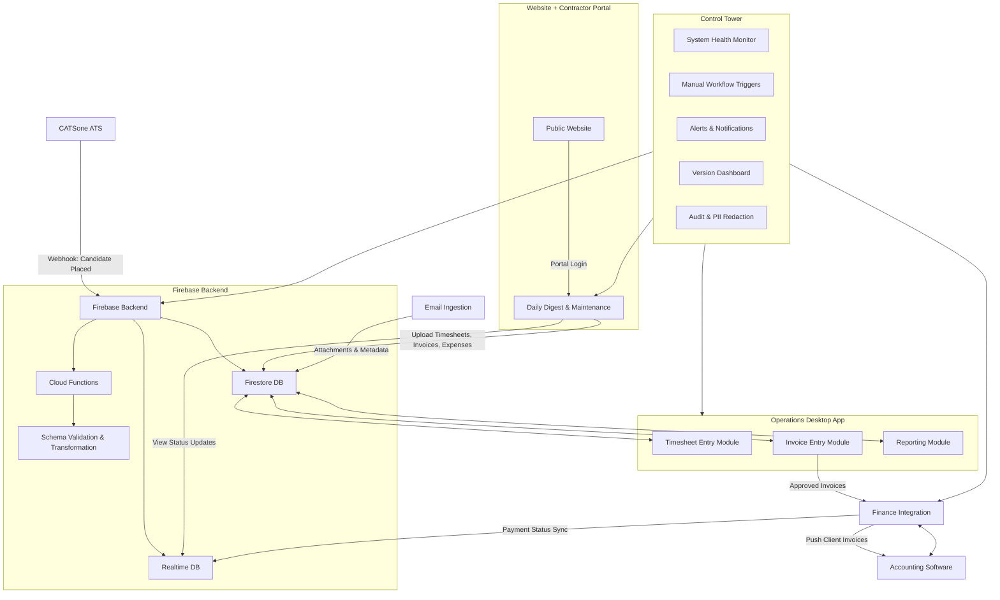

# Swan ERP – System Flow Diagram

The diagram below is rendered with Mermaid (supported by GitHub).

```mermaid
flowchart TD

    %% External Systems
    A[CATSone ATS] -->|Webhook: Candidate Placed| B[Firebase Backend]
    Z[Accounting Software] <--> I[Finance Integration]

        %% Firebase Core
        subgraph F[Firebase Backend]
            B --> C[Firestore DB]
            B --> D[Realtime DB]
            B --> E[Cloud Functions]
            E --> SF[Schema Validation & Transformation]
        end

    %% Contractor Portal + Website
    subgraph W[Website + Contractor Portal]
        P[Contractor Portal]
        Q[Public Website]
    end

    P -->|Upload Timesheets, Invoices, Expenses| C
    P -->|View Status Updates| D
    Q -->|Portal Login| P

        %% Email Ingestion
        U[Email Ingestion] -->|Attachments & Metadata| C

    %% Desktop App
    subgraph X[Operations Desktop App]
        H[Timesheet Entry Module]
        G[Invoice Entry Module]
        J[Reporting Module]
    end

    C <--> H
    C <--> G
    C <--> J

    %% Finance Integration
    I -->|Push Client Invoices| Z
    I -->|Payment Status Sync| D
    G -->|Approved Invoices| I

        %% Control Tower
        subgraph CT[Control Tower]
            K[System Health Monitor]
            L[Manual Workflow Triggers]
            M[Alerts & Notifications]
            N[Version Dashboard]
            O[Audit & PII Redaction]
            P[Daily Digest & Maintenance]
        end

    CT --> B
    CT --> P
    CT --> X
    CT --> I
```
