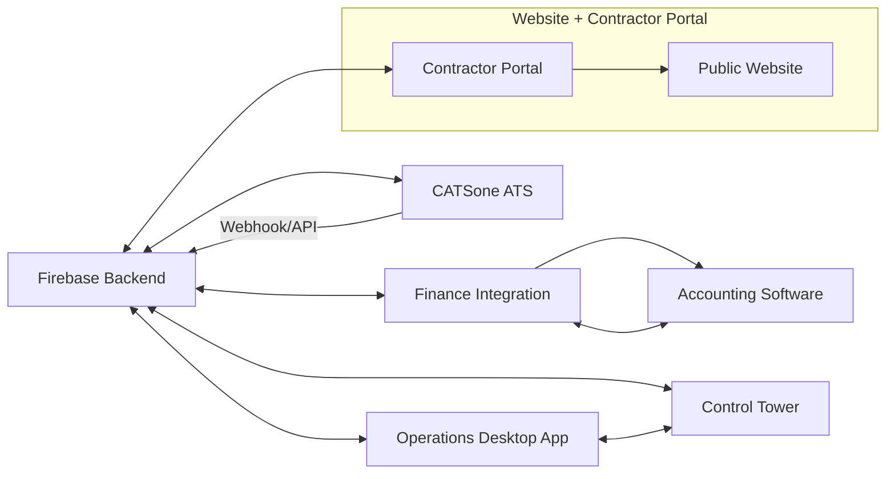

# Swan ERP – Module Interaction Map

High-level overview of how core modules and systems interact.

```mermaid
flowchart LR

    %% Core Hub
    F[Firebase Backend]

    %% External System
    CATS[CATSone ATS] -->|Webhook/API| F
    ACC[Accounting Software] <--> FIN[Finance Integration]

    %% Contractor Portal & Website
    subgraph WEB[Website + Contractor Portal]
        P[Contractor Portal]
        W[Public Website]
    end

    %% Desktop Application
    D[Operations Desktop App]

    %% Control Tower
    CT[Control Tower]

    %% Links
    F <--> P
    F <--> D
    F <--> FIN
    F <--> CT
    F <--> CATS

    P --> W
    FIN --> ACC
    D <--> CT
```
