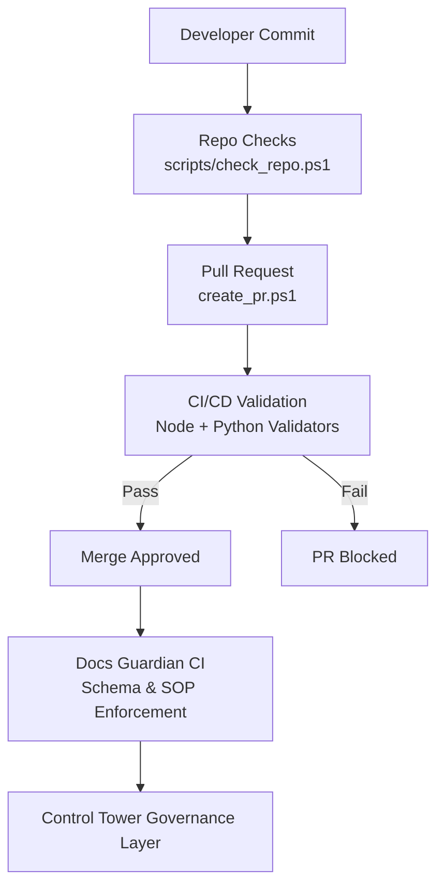

# Governance Flow

```mermaid
flowchart TD
    A[Developer Commit] --> B[Repo Checks<br/>scripts/check_repo.ps1]
    B --> C[Pull Request<br/>create_pr.ps1]
    C --> D[CI/CD Validation<br/>Node + Python Validators]
    D -->|Pass| E[Merge Approved]
    D -->|Fail| X[PR Blocked]
    E --> F[Docs Guardian CI<br/>Schema & SOP Enforcement]
    F --> G[Control Tower Governance Layer]
```
---
⬅ Return to [Docs Index](../index.md)
