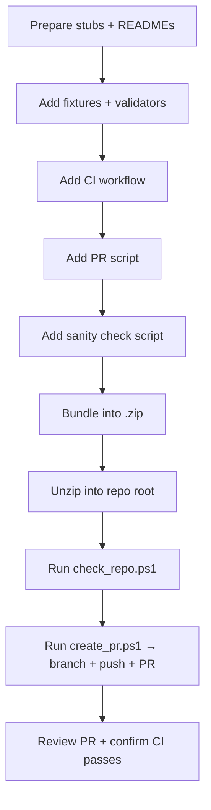

# SOP: Packaging and Publishing MVP Stub Packages

## 🧾 Metadata
- **SOP Family:** System, Workflow, Risk, Ops, Visual Map, Training, Audit, Exception  
- **Applies To:** Swan ERP project repositories  
- **Version:** v1.0  
- **Owner:** Ben Pitman  
- **Last Updated:** 2025-09-28  

---

## 🎯 Purpose
Define the **repeatable procedure** for preparing, packaging, validating, and publishing MVP stub packages.  
Ensures all Swan ERP Projects repos adopt consistent CI enforcement, schema validation, and PR automation.

---

## 📥 Inputs
- Base stubs for backend and desktop manager  
- Schema definitions (`event.schema.json`, `run.schema.json`)  
- Fixture examples (`event.json`, `run.json`)  
- Validators (Node/AJV + Python/Pydantic)  
- Repo cloned locally  

---

## 1. **System SOP** – Rules & Architecture
- All packages must include:  
  - Backend & desktop stubs  
  - Docs + fixtures  
  - Node + Python validators  
  - CI workflow (fail on error)  
  - PR automation script (`create_pr.ps1`)  
  - Sanity check script (`check_repo.ps1`)  
- Must be zipped before handoff.  
- CI must run on all PRs; no bypass.  

---

## 2. **Workflow SOP** – Step-by-Step Process



### Steps
1. Prepare stubs + README docs  
2. Add fixtures + validators  
3. Add CI workflow  
4. Add PR automation script  
5. Add sanity check script  
6. Bundle into `.zip`  
7. Unzip into repo root  
8. Run sanity check  
9. Run PR script (creates branch + PR)  
10. Review PR and confirm CI badge is green  

---

## 3. **Risk SOP** – Failure Modes

| Risk | Impact | Control |
|------|--------|----------|
| Wrong unzip location | Scripts fail | Run `check_repo.ps1` |
| Missing GitHub CLI | PR not auto-created | Use printed fallback URL |
| CI skipped | Invalid data merged | Protect `main` branch |
| Schema drift | Fixtures invalid | Update validators when schema changes |
| File overwrite | Loss of edits | Start from clean branch |

---

## 4. **Ops SOP** – Daily Use
- Run validators locally before packaging:  
  ```bash
  node validate_event.js
  python validate_event.py
  ```  
- Keep fixtures synced with schema.  
- Verify CI badge after merges.  
- Archive zipped packages in backups drive.  

---

## 5. **Visual Map SOP** – CI + PR Flow

```mermaid
flowchart LR
    subgraph Repo Root
      P1[check_repo.ps1] --> OK{Repo valid?}
      OK -- yes --> PR[create_pr.ps1]
      OK -- no --> ERR[Stop & fix]
    end
    
    PR --> BR[Create branch]
    BR --> CM[Commit stubs]
    CM --> PU[Push to origin]
    PU --> GH[Open PR (gh or URL)]
    GH --> CI[GitHub Actions]
    CI -->|pass| MR[Merge ready]
    CI -->|fail| FIX[Fix validators/fixtures]
```

---

## 6. **Training SOP** – New Contributor Guide
1. Clone repo locally  
2. Unzip package into repo root  
3. Run `scripts/check_repo.ps1`  
4. Run `create_pr.ps1`  
5. Confirm PR badge is green before merge  

---

## 7. **Audit SOP** – Governance
- Quarterly check:
  - Workflow file present across repos  
  - Node + Python validators exist  
  - CI badges correct  
- Log all packages + PRs in audit sheet  

---

## 8. **Exception SOP** – Special Cases
- Schema missing → block process, escalate  
- Repo not initialized → `git init` before running  
- GitHub CLI missing → PR created manually via URL  

---

## 📊 Metrics
- ✅ Package builds with no missing files  
- ✅ CI passes on fixtures  
- ✅ PR script opens a valid PR  
- ✅ Badge reflects validation state
---
⬅ Return to [Docs Index](../index.md)
