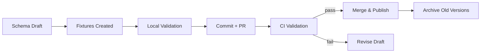

# SOP: Schema Lifecycle Management

## 🧾 Metadata
- **SOP Family:** System, Workflow, Risk, Ops, Visual Map, Training, Audit, Exception  
- **Applies To:** All Swan ERP schemas (`event.schema.json`, `run.schema.json`, etc.)  
- **Version:** v1.0  
- **Owner:** Ben Pitman  
- **Last Updated:** 2025-09-28  

---

## 🎯 Purpose
Ensure all data schemas (JSON Schema contracts) in Swan ERP are designed, versioned, validated, and enforced consistently across repos.  
Schemas are **contracts** between systems — they must be stable, validated, and enforced by CI.

---

## 📥 Inputs
- Schema drafts (new or updated)  
- Fixture examples (`*.json`)  
- Validator scripts (Node/AJV + Python/Pydantic)  
- GitHub repo with CI enabled  

---

## 1. **System SOP** – Rules
- Every schema must be stored under `docs/schemas/` or equivalent.  
- Schemas must follow **JSON Schema Draft 2020-12**.  
- Each schema must have:
  - `$id` (unique identifier, semantic versioned)  
  - `title` and `description`  
  - `required` fields defined  
  - Example fixture in `docs/fixtures/`  
- Schema versions are immutable once merged (patches → new version).  
- CI must validate all fixtures against their schema.  

---

## 2. **Workflow SOP** – Step-by-Step Process

```mermaid
flowchart TD
    A[Draft schema vNext] --> B[Add fixture example]
    B --> C[Update validators (Node+Python)]
    C --> D[Run local validation]
    D --> E[Commit schema + fixtures + validators]
    E --> F[PR triggers CI validation]
    F -->|Pass| G[Merge schema]
    F -->|Fail| FIX[Fix schema or fixture]
```

### Steps
1. Draft schema in `docs/schemas/`.  
2. Create/update matching fixture(s) in `docs/fixtures/`.  
3. Update validators if schema fields change.  
4. Run local validation (`node validate_event.js`, `python validate_event.py`).  
5. Commit schema, fixtures, validators.  
6. Push → PR runs CI validation.  
7. Merge only if CI passes.  

---

## 3. **Risk SOP** – Failure Modes

| Risk | Impact | Control |
|------|--------|----------|
| Breaking schema change | Downstream repos fail | Use semantic versioning (`v1`, `v1.1`, etc.) |
| Missing required field | Silent failures | Write fixtures for all required cases |
| CI bypass | Invalid schema merges | Protect `main` branch with required workflow |
| Schema drift | Different repos diverge | Single source of truth repo for schemas |

---

## 4. **Ops SOP** – Daily Use
- Validate locally before PR:
  ```bash
  node validate_event.js
  python validate_event.py
  ```  
- Always bump schema version instead of editing in place.  
- Archive old schema versions in `docs/schemas/archive/`.  
- Keep fixtures updated whenever schema changes.  

---

## 5. **Visual Map SOP** – Schema Lifecycle



---

## 6. **Training SOP** – New Contributor Guide
- Write schema in JSON Schema format.  
- Add example JSON in fixtures.  
- Run validators locally before commit.  
- Open PR → let CI enforce correctness.  
- Never delete old schema versions, only deprecate.  

---

## 7. **Audit SOP** – Governance
- Monthly check:
  - Do all schemas have `$id`, `title`, `description`?  
  - Do fixtures exist for each schema version?  
  - Does CI workflow validate against **latest schema**?  
- Record schema versions and PR IDs in audit log.  

---

## 8. **Exception SOP** – Special Cases
- Emergency fix → branch protection bypass requires Director approval.  
- If fixture cannot be created (e.g., placeholder), mark clearly in PR description and track with TODO.  
- Schema for experimental feature may be kept in `docs/schemas/experimental/` but cannot be used in production.  

---

## 📊 Metrics
- ✅ 100% of schemas have fixtures.  
- ✅ CI workflow validates fixtures on every PR.  
- ✅ No breaking schema changes merged without new version.  
- ✅ Downstream repos always consume latest stable schema.
---
⬅ Return to [Docs Index](../index.md)
